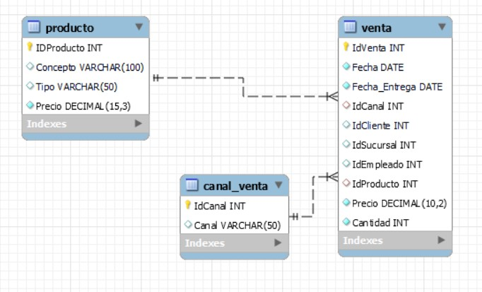

<h1>Bootcamp Módulo 2</h1>

 

Cómo responder: 

Cuando se pida una respuesta numérica y tenga decimales, redondear al segundo decimal (Recordar que el 5 redondea para arriba).

Ejemplo: 1.3421 -&gt; 1.34 

1.8888 -&gt; 1.89 

1.855 -&gt; 1.86 

<h2>Responder Verdadero o Falso</h2>

1) Todas las métricas no son KPIs, pero todos los KPIs están basados en métricas. 

2) Dentro de un espacio muestral, ¿es posible tener eventos desconocidos, debido a que no es posible saber todos los escenarios posibles dentro de un experimento aleatorio? 

<h2>Elegir la opción correcta</h2>

3) El espacio muestral es:

Opciones: 

1- El conjunto de todos los resultados posibles de un experimento.

2- Una tabla con las distintas funciones de probabilidad.

3- Un evento que puede describirse con una característica única.

4) Si los sucesos A y B son mutuamente excluyentes, entonces siempre sucede que:

Opciones: 

a - La probabilidad de que suceda B (P(B)) se calcula como el inverso de la probabilidad de que suceda a (1-P(A))

b - Debe ocurrir al menos uno de los sucesos, es decir: si no sucede A, debe suceder B y viceversa.

c - Si dentro de un experimento aleatorio ocurre el suceso A, no es posible la ocurrencia del suceso B.

5) Si una empresa indica "nuestra retención de clientes ha aumentado un 20% respecto al año anterior, tal como nos habíamos propuesto", ¿De qué está hablando?

Opciones: 

a - Métrica 

b - KPI

<h2>Responde las siguientes preguntas sobre Estadística y Probabilidad</h2>
<h3>Las respuestas sobre probabilidades se deben expresar entre 0 y 1, y con el criterio ya mencionado de redondeo a dos decimales.</h3>
<h3>Ej: no 25%, sino 0.25</h3>

6) Acabo de llegar al casino, y en la mesa de ruleta clásica (37 números, 0-36) acaba de salir el 3. ¿Cuál es la probabilidad de que se repita este número, saliendo en el próximo tiro? 

7) Un jugador tiene dos dados, luego lanza los dos dados a la vez y suma el resultado obtenido de los dados lanzados, ¿cuál es la suma resultante más probable al momento de lanzar los dos dados? 

8) Se tienen 4 canicas blancas y 4 canicas negras dentro de un frasco, luego de manera aleatoria se sacan dos canicas, una detrás de la otra. ¿Cuál es la probabilidad de que ambas sean de un mismo color? 

9) En una sala de espera, atienden a 3 personas cada 7 minutos. ¿Cuál es la probabilidad de que en 7 minutos atiendan a 2 personas? 

10) En un control de calidad, se tiene que de 65 productos seleccionados, 2 poseen fallas de fabricación, ¿Cuál es la probabilidad de encontrar un producto con fallas si se seleccionan 5 productos? 

<h2>Contestar las siguientes preguntas, utilizando el DER y mysql:</h2>

 

En tu motor de base de datos MySQL, ejecutá las instrucciones del script 'Checkpoint_Create_Insert.sql' (Si no trabajas con MySQL es posible que tengas que realizar algunos ajustes en el script. También están provistas las tablas en formato csv dentro de la carpeta 'tablas_cp'). 

11) ¿Cuál es el canal de venta que tiene la segunda posición en cantidad de ventas en 2020? 

Opciones: 

1- Telefónica

2- OnLine

3- Presencial

12) ¿Cuál fue el canal de venta con menor cantidad de productos vendidos en el año 2020? 

Opciones: 

1- Telefónica

2- OnLine

3- Presencial

13) ¿Cuál es el Id del empleado que menor cantidad de productos vendió en el histórico de ventas de la empresa? 

Opciones: 

a - 3603 

b - 3504

c - 1723

d - 3186

e - 2557

14) Se define el tiempo de entrega como el tiempo en días transcurrido entre que se realiza la compra y se efectua la entrega. Para realizar mejoras la dirección desea saber cuál es el mes con su respectivo año, con el promedio más bajo de este tiempo de entrega. (Fecha = Fecha de venta, Fecha_Entrega = Fecha de entrega) 

15) ¿Cuántos productos poseen un tipo que comienza con la letra 'I'? 

16) ¿Cuantos productos tienen la palabra CD en alguna parte de su descripción (Concepto = Descripción del Producto) y su precio es mayor a 500? 

17) ¿Cuál es el id del Producto cuyo nombre es EPSON COPYFAX 2000? 

18) Considerando el año 2017, ¿Cuál fue el mes (considerando la fecha de venta, es decir, usando el campo Fecha) con mayor monto total de venta (monto de venta = Precio*Cantidad) para el empleado 1426? 

Opciones: 

a - 5

b - 4

c - 7

d - 3

e - 11
